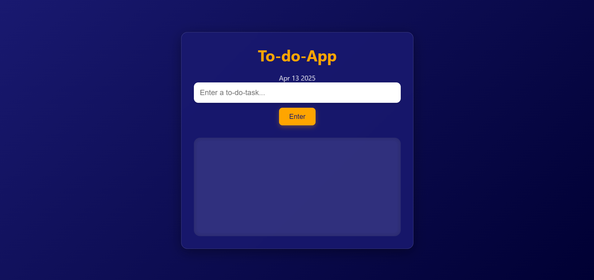
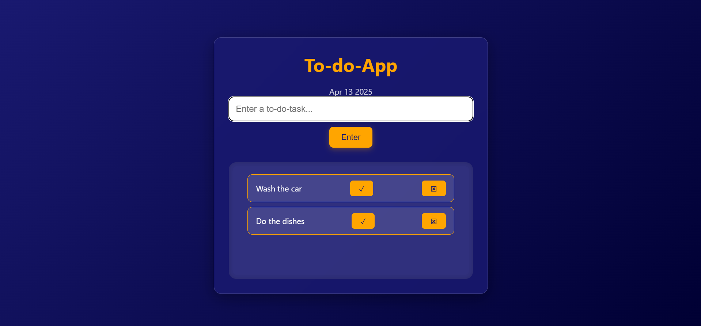

# 📝 To-Do List App

This is a to-do list web app built with **HTML**, **CSS**, and **JavaScript**. It allows users to add tasks, mark them as complete, and delete them and it follows the **60-30-10 color rule**.

---

## 🚀 Features

- 📅 Displays current date
- ➕ Add new tasks
- ✅ Mark tasks as complete
- ❌ Delete tasks
- 🎨 Stylish design with blur effects and shadows
- 📱 Responsive design

---

## 📸 Screenshots




---

## 🛠️ Tech Stack

- **HTML5**
- **CSS3**
- **Vanilla JavaScript (ES6)**

---

## 💡 How to Use
```bash
1. **Clone this repository**
   
   git clone https://github.com/Computeroid1/Project_Vanilla.git

2. **Navigate to the project folder**
    cd To-do-App

3. **Open index.html in your browser**
    open index.html

4. **Start Adding Tasks!**
```

##  Project Structure
    ├── index.html       # Main HTML structure
    ├── style.css        # Styling and theming
    ├── script.js        # Functionality (add/remove/complete)
    └── README.md        # This file

## 🎨 Color Scheme (60-30-10 Rule)
- Primary (60%): Midnight Blue (#191970)
- Secondary (30%): White (#ffffff)
- Accent (10%): Orange (#FFA500)